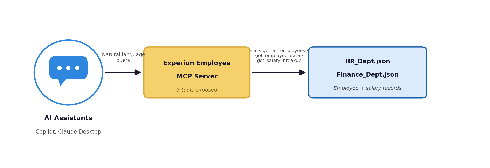
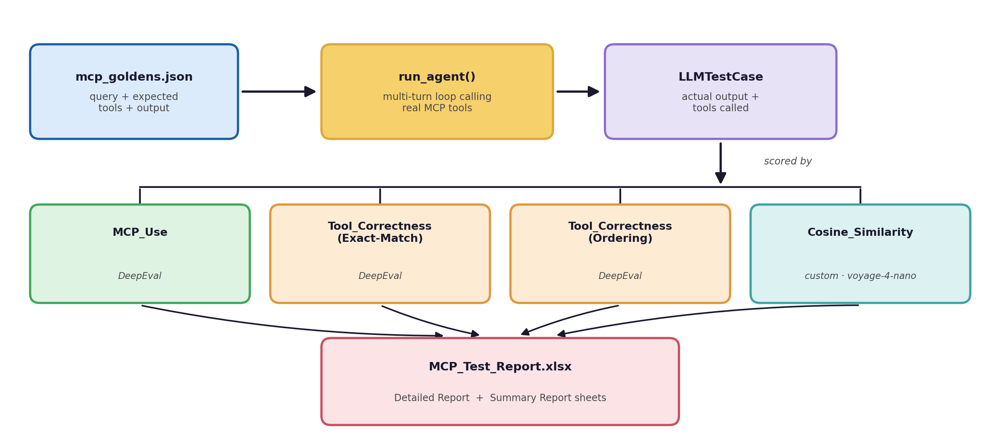

# Experion Employee MCP Server

- A Python-based MCP ([Model Context Protocol](https://modelcontextprotocol.io/)) server that integrates with an MCP Client (GitHub Copilot or Claude Desktop) as a tool for querying employee HR and salary data.
- Built with Python, it runs as a local standard I/O server that can be configured in various MCP clients like VS Code's `mcp.json` or `.mcp.json` for Claude Desktop.
- [Read more](https://modelcontextprotocol.io/docs/develop/build-server)

# High level design



# Demo in action (with Claude Desktop)


# Sample prompts

````shell
get_all_employees {} # Lists every employee's EmpId + Name.

get_employee_data {"emp_id": 102} # Returns the full HR profile for one EmpId (Dept, Location, Email, Mobile).

get_salary_breakup {"emp_id": 102} # Returns CTC + Total Allowance for one EmpId.

Find the employee with the highest CTC and give me their full profile along with salary breakup.
````

# Setting Up the Experion Employee MCP Server

## Clone the Repository

````powershell
git clone https://github.com/<your-username>/experion-employee-mcp
cd experion-employee-mcp
````

## Set up the environment (uv)

This repo uses [`uv`](https://docs.astral.sh/uv/) for dependency and environment management instead of plain `venv`/`pip`.

````powershell
uv sync
````

Add your API keys to a `.env` file in the project root:
````
OPENAI_API_KEY=sk-...
VOYAGE_API_KEY=...
````

## Run the Server

````powershell
uv run python server.py
````

# Configure for Claude Desktop (optional)
- Add the following JSON to your `claude_desktop_config.json` file.
- [Read more](https://modelcontextprotocol.io/docs/develop/build-server)

````json
{
  "mcpServers": {
    "ExperionEmployeeMCP": {
      "type": "stdio",
      "command": "uv",
      "args": [
        "run",
        "python",
        "C:\\Users\\madhav.a\\Desktop\\MCP-Exploration\\Experion-MCP\\server.py"
      ]
    }
  }
}
````

# Configure for Copilot (through Visual Studio Code)
- If you're using VS Code with [GitHub Copilot](https://github.com/features/copilot), add the following configuration to your `~/.vscode/mcp.json` file and restart VS Code.
- [Read more](https://code.visualstudio.com/docs/copilot/customization/mcp-servers)

````json
{
  "servers": {
    "ExperionEmployeeMCP": {
      "type": "stdio",
      "command": "uv",
      "args": [
        "run",
        "python",
        "C:\\Users\\madhav.a\\Desktop\\MCP-Exploration\\Experion-MCP\\server.py"
      ]
    }
  }
}
````

## Verify Copilot sees your MCP server
- Open VS Code Command Palette (Cmd+Shift+P on Mac, Ctrl+Shift+P on Windows).
- Search for `Copilot: List MCP Servers` (this command was added when MCP support shipped).
- You should see ExperionEmployeeMCP in the list.

If it's missing:
- Check that your `~/.vscode/mcp.json` path is correct.
- Check the log: **View** → **Output** → **Copilot (dropdown)** for MCP errors.

## Debugging tips
- If Copilot doesn't show your server: check `~/.vscode/mcp.json` syntax (must be valid JSON).
- If the server crashes: run `uv run python server.py` manually in a terminal to see errors.
- You can also add debug `print()` calls in `execute_tools` to see incoming requests.

---

# Testing

All testing was done from the project root:

````powershell
cd "C:\Users\madhav.a\Desktop\MCP-Exploration\Experion-MCP"
````

## 1. MCP Inspector

Verified all three tools (`get_all_employees`, `get_employee_data`, `get_salary_breakup`) using MCP Inspector, in both interactive and scripted modes.

**Web UI mode:**
````powershell
npx @modelcontextprotocol/inspector uv run python server.py
````

**CLI mode:**
````powershell
# List available tools
npx @modelcontextprotocol/inspector --cli uv run python server.py --method tools/list

# Call a tool
npx @modelcontextprotocol/inspector --cli uv run python server.py --method tools/call --tool-name get_employee_data --tool-arg emp_id=102
````

## 2. Pester Contract Tests

HR and salary data can change over time, so testing against specific values is unreliable. Instead, this suite validates that the **JSON response structure** stays stable — checking that expected keys (`EmpId`, `Employee Name`, `CTC`, `Total Allowance`, etc.) are present, independent of what the actual data values are.

````powershell
Invoke-Pester -Path .\Employee_Contract_Tests.ps1
````

## 3. DeepEval Evaluation Pipeline

Beyond structural contract testing, this repo includes a full **agent-level evaluation pipeline** (`mcp_eval.py`) that runs natural-language queries end-to-end through a real multi-turn agent loop against the live MCP tools.



Each query is scored on 4 metrics:

- **MCP_Use** (DeepEval) — judges whether tool args and results were used sensibly in the final answer
- **Tool_Correctness — Exact Match** (DeepEval) — were exactly the right tools called, no extras or missing
- **Tool_Correctness — Ordering** (DeepEval) — were tools called in the correct sequence
- **Cosine_Similarity** (custom, `cosine_metric.py`) — semantic similarity between expected and actual output, using Voyage AI's `voyage-4-nano` embedding model via `sentence-transformers`

Results are exported to a styled Excel report (`report.py`) with a **Detailed Report** sheet (per-query scores, color-coded by per-metric threshold) and a **Summary Report** sheet (per-metric average score, pass rate, and total, plus an overall pass/fail banner).

````powershell
uv run python mcp_eval.py
````

> **Note:** Metric thresholds, the embedding model name, and data file paths are centralized in `config.py`.

# Project structure

```
├── server.py              # MCP server exposing the 3 tools
├── data_store.py          # Experion_DataStore — reads HR/Finance JSON
├── config.py                # Centralized paths, model names, thresholds
├── mcp_eval.py               # Evaluation agent loop + DeepEval scoring
├── cosine_metric.py          # Custom Voyage AI embedding-based similarity metric
├── report.py                 # Excel report generator
├── hr_dept.json               # HR records
├── finance_dept.json          # Salary records
└── mcp_goldens.json            # Golden test queries + expected tools/output
```